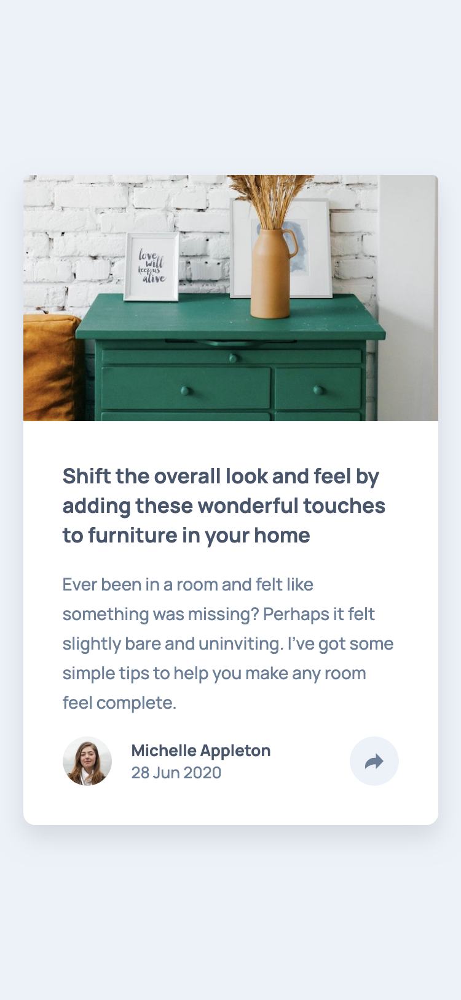
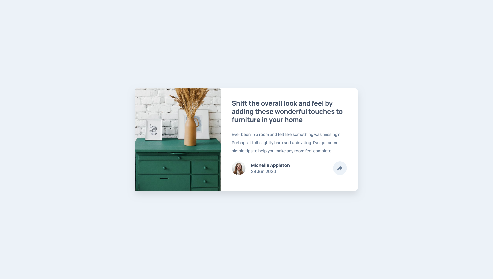

# Frontend Mentor - Article preview component solution

This is a solution to the [Article preview component challenge on Frontend Mentor](https://www.frontendmentor.io/challenges/article-preview-component-dYBN_pYFT). Frontend Mentor challenges help you improve your coding skills by building realistic projects.

## My process

### Screenshots

### Built with

- Semantic HTML5 markup
- Vanilla CSS
- CSS Grid
- Mobile-first workflow

### What I learned

Learned key concepts in JS and mobile-first workflow.

## Acknowledgments

Thank you to anyone who provides feedback on this solution. Constructive feedback supports continuous learning and helps me gain new perspectives on problem-solving.
