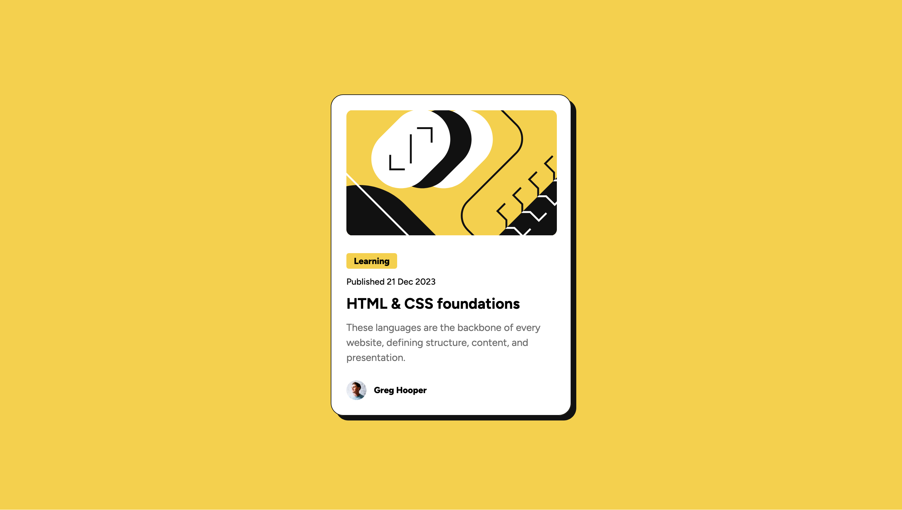

# Frontend Mentor - Blog preview card solution

This is a solution to the [Blog preview card challenge on Frontend Mentor](https://www.frontendmentor.io/challenges/blog-preview-card-ckPaj01IcS). Frontend Mentor challenges help you improve your coding skills by building realistic projects.

## My process

### Built with

- Semantic HTML5 markup
- Vanilla CSS
- Desktop-first workflow

### What I learned

This project provided figma design files, which helped me to learn about spacing in design. Most importantly it taught how spacing, fonts affect overall design and one needs to be consistent with it to make design visually appealing.

## Acknowledgments

Thank you to anyone who provides feedback on this solution. Constructive feedback supports continuous learning and helps me gain new perspectives on problem-solving.
