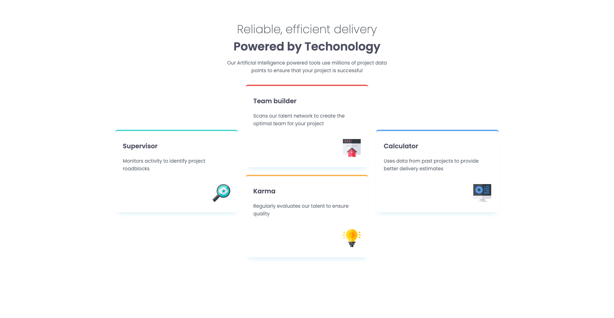

# Frontend Mentor - Four card feature section solution

This is a solution to the [Four card feature section challenge on Frontend Mentor](https://www.frontendmentor.io/challenges/four-card-feature-section-weK1eFYK). Frontend Mentor challenges help you improve your coding skills by building realistic projects.

## My process

### Screenshots

### Built with

- Semantic HTML5 markup
- Vanilla CSS
- Mobile-first workflow

### What I learned

I learned about grids and placing items inside the container. First I struggled with box-shadows, but then found the way to make box shadown work in expected manner.

## Acknowledgments

Thank you to anyone who provides feedback on this solution. Constructive feedback supports continuous learning and helps me gain new perspectives on problem-solving.
