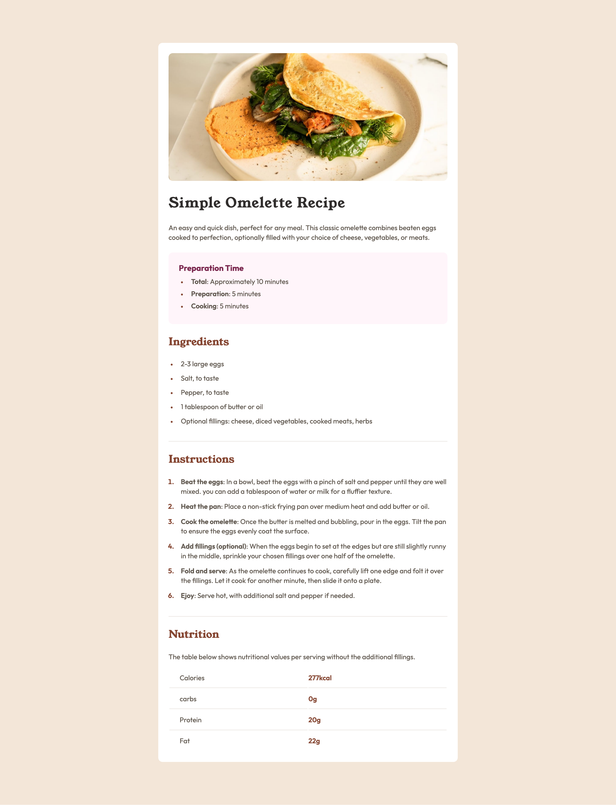

# Frontend Mentor - Recipe page solution

This is a solution to the [Recipe page challenge on Frontend Mentor](https://www.frontendmentor.io/challenges/recipe-page-KiTsR8QQKm). Frontend Mentor challenges help you improve your coding skills by building realistic projects.

## My process

### Built with

- Semantic HTML5 markup
- Vanilla CSS
- Desktop-first workflow

### What I learned

Although this is a “newbie-level” challenge, it was a useful exercise in reinforcing the basics. I was reminded of the importance of planning layouts visually before writing code. Having the design reference open while coding made the workflow more efficient and helped me stay consistent with spacing, typography, and structure.

## Acknowledgments

Thank you to anyone who provides feedback on this solution. Constructive feedback supports continuous learning and helps me gain new perspectives on problem-solving.
