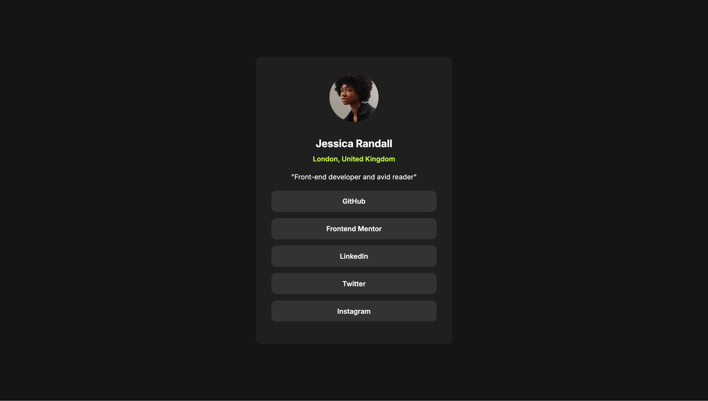
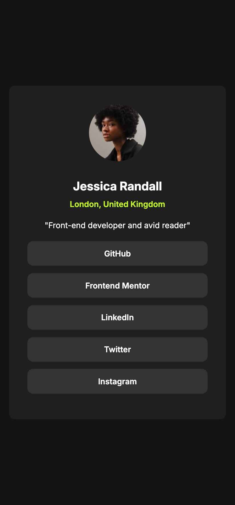

# Frontend Mentor - Social links profile solution

This is a solution to the [Social links profile challenge on Frontend Mentor](https://www.frontendmentor.io/challenges/social-links-profile-UG32l9m6dQ). Frontend Mentor challenges help you improve your coding skills by building realistic projects.

## My process

### Built with

- Semantic HTML5 markup
- Vanilla CSS
- Desktop-first workflow
- Responsive Design

### What I learned

This challenge taught me how important it is to choose a colour palette that creates a balanced, calming design without overwhelming the layout.

## Acknowledgments

Thank you to anyone who provides feedback on this solution. Constructive feedback supports continuous learning and helps me gain new perspectives on problem-solving.
